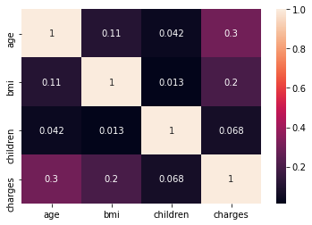
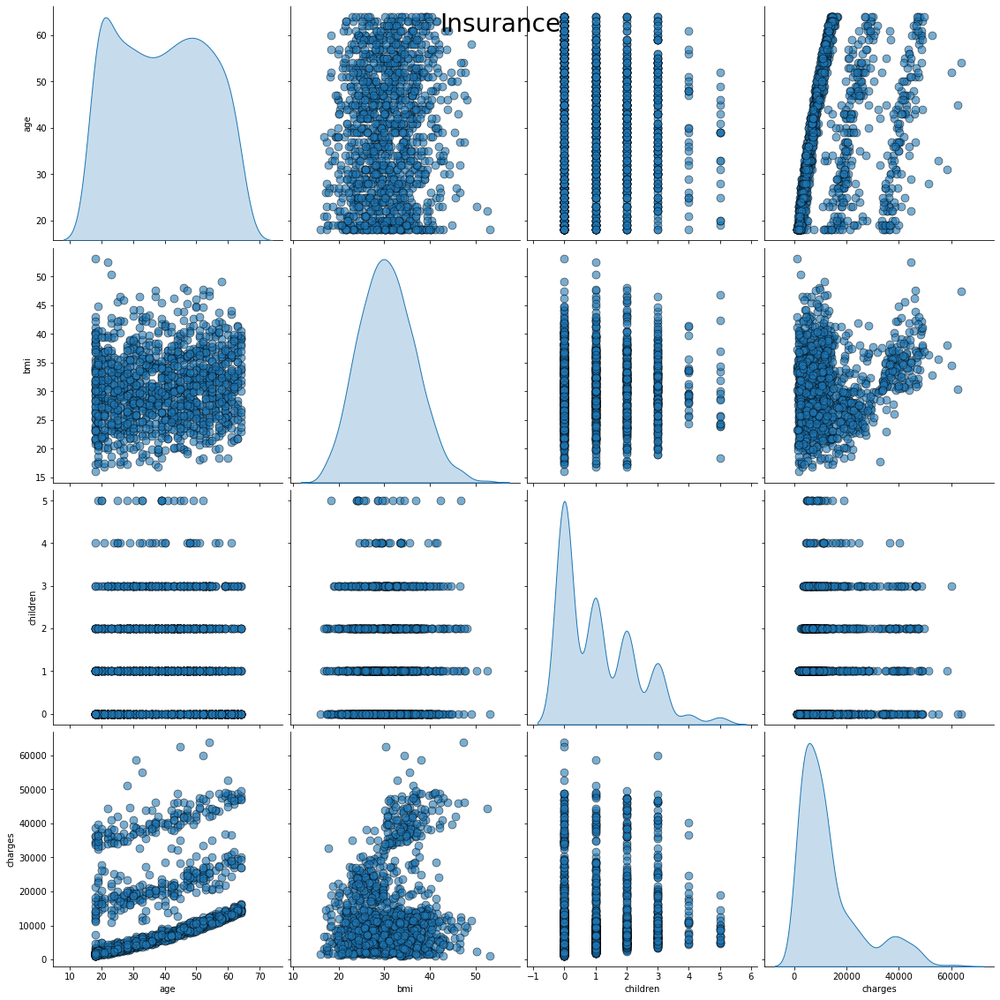
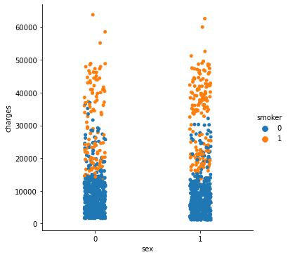
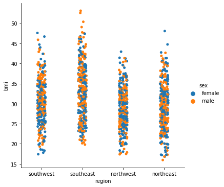

```python
#Import Necessary Packages
import pandas as pd
import numpy as np
from sklearn.linear_model import LinearRegression
from sklearn.model_selection import train_test_split
from sklearn.metrics import r2_score,adjusted_rand_score
from sklearn.preprocessing import LabelEncoder
import matplotlib.pyplot as plt
import seaborn as sb
%matplotlib inline
import seaborn as sns
```


```python
#Load data
Insurance = pd.read_csv('insurance.csv')
```


```python
Insurance.head()
```


<div>
<style scoped>
    .dataframe tbody tr th:only-of-type {
        vertical-align: middle;
    }

    .dataframe tbody tr th {
        vertical-align: top;
    }

    .dataframe thead th {
        text-align: right;
    }
</style>
<table border="1" class="dataframe">
  <thead>
    <tr style="text-align: right;">
      <th></th>
      <th>age</th>
      <th>sex</th>
      <th>bmi</th>
      <th>children</th>
      <th>smoker</th>
      <th>region</th>
      <th>charges</th>
    </tr>
  </thead>
  <tbody>
    <tr>
      <th>0</th>
      <td>19</td>
      <td>female</td>
      <td>27.900</td>
      <td>0</td>
      <td>yes</td>
      <td>southwest</td>
      <td>16884.92400</td>
    </tr>
    <tr>
      <th>1</th>
      <td>18</td>
      <td>male</td>
      <td>33.770</td>
      <td>1</td>
      <td>no</td>
      <td>southeast</td>
      <td>1725.55230</td>
    </tr>
    <tr>
      <th>2</th>
      <td>28</td>
      <td>male</td>
      <td>33.000</td>
      <td>3</td>
      <td>no</td>
      <td>southeast</td>
      <td>4449.46200</td>
    </tr>
    <tr>
      <th>3</th>
      <td>33</td>
      <td>male</td>
      <td>22.705</td>
      <td>0</td>
      <td>no</td>
      <td>northwest</td>
      <td>21984.47061</td>
    </tr>
    <tr>
      <th>4</th>
      <td>32</td>
      <td>male</td>
      <td>28.880</td>
      <td>0</td>
      <td>no</td>
      <td>northwest</td>
      <td>3866.85520</td>
    </tr>
  </tbody>
</table>
</div>


```python
Insurance.shape
```


    (1338, 7)


```python
Insurance.isnull().sum()
```


    age         0
    sex         0
    bmi         0
    children    0
    smoker      0
    region      0
    charges     0
    dtype: int64


```python
Insurance.info()
```

    <class 'pandas.core.frame.DataFrame'>
    RangeIndex: 1338 entries, 0 to 1337
    Data columns (total 7 columns):
     #   Column    Non-Null Count  Dtype  
    ---  ------    --------------  -----  
     0   age       1338 non-null   int64  
     1   sex       1338 non-null   object 
     2   bmi       1338 non-null   float64
     3   children  1338 non-null   int64  
     4   smoker    1338 non-null   object 
     5   region    1338 non-null   object 
     6   charges   1338 non-null   float64
    dtypes: float64(2), int64(2), object(3)
    memory usage: 73.3+ KB
    


```python
Insurance.drop(['region'],axis=1,inplace=True)
```

# co-realtion


```python
data_new=data.corr()
sns.heatmap(data_new,annot=True)
```


    <AxesSubplot:>


    

    


```python
#Visualization of Dataset
sns.pairplot(data, diag_kind = 'kde',
             plot_kws = {'alpha': 0.6, 's': 80, 'edgecolor': 'k'},
             size = 4)
plt.suptitle('Insurance', 
             size = 28);
```

    C:\Users\pramodh\Anaconda3\lib\site-packages\seaborn\axisgrid.py:1912: UserWarning: The `size` parameter has been renamed to `height`; please update your code.
      warnings.warn(msg, UserWarning)
    


    

    


```python
sns.catplot(x = 'sex',y = 'charges',data=Insurance , hue = 'smoker')
```


    <seaborn.axisgrid.FacetGrid at 0x199bf1cd948>


    

    


```python
sns.catplot(x = 'region' , y = 'bmi', data = Insurance ,  hue = 'sex')
```


    <seaborn.axisgrid.FacetGrid at 0x199c103df48>


    

    


```python
#Encoding
Insurance.loc[:,['sex','smoker']]= Insurance.loc[:,['sex','smoker']].apply(LabelEncoder().fit_transform)
```

# Linear Regeression


```python
X = Insurance.iloc[:,:-1]
y = Insurance['charges']
X.head()
```


<div>
<style scoped>
    .dataframe tbody tr th:only-of-type {
        vertical-align: middle;
    }

    .dataframe tbody tr th {
        vertical-align: top;
    }

    .dataframe thead th {
        text-align: right;
    }
</style>
<table border="1" class="dataframe">
  <thead>
    <tr style="text-align: right;">
      <th></th>
      <th>age</th>
      <th>sex</th>
      <th>bmi</th>
      <th>children</th>
      <th>smoker</th>
    </tr>
  </thead>
  <tbody>
    <tr>
      <th>0</th>
      <td>19</td>
      <td>0</td>
      <td>27.900</td>
      <td>0</td>
      <td>1</td>
    </tr>
    <tr>
      <th>1</th>
      <td>18</td>
      <td>1</td>
      <td>33.770</td>
      <td>1</td>
      <td>0</td>
    </tr>
    <tr>
      <th>2</th>
      <td>28</td>
      <td>1</td>
      <td>33.000</td>
      <td>3</td>
      <td>0</td>
    </tr>
    <tr>
      <th>3</th>
      <td>33</td>
      <td>1</td>
      <td>22.705</td>
      <td>0</td>
      <td>0</td>
    </tr>
    <tr>
      <th>4</th>
      <td>32</td>
      <td>1</td>
      <td>28.880</td>
      <td>0</td>
      <td>0</td>
    </tr>
  </tbody>
</table>
</div>


```python
X_train,X_test,y_train,y_test = train_test_split(X,y,test_size=0.25,random_state=45)
```


```python
model = LinearRegression(fit_intercept=True)
model.fit(X_train,y_train)
y_predict = model.predict(X_test)
r2=r2_score(y_test,y_predict)#checking r2_score
r2
```


    0.7040911996613199


```python
len(X_train.columns)
```


    5


```python
n = Insurance.shape[0]
p = len(X_train.columns)
```


```python
adj = 1-(1-r2)*(n-1)/(n-p-1)
adj
```


    0.7029804308912799


# RandomForest


```python
import pandas as pd
import numpy as np
import matplotlib.pyplot as plt
from matplotlib import rcParams
from sklearn.model_selection import train_test_split
from sklearn.ensemble import RandomForestRegressor
from sklearn.metrics import accuracy_score,adjusted_rand_score,mean_absolute_error,mean_squared_error
from collections import Counter
from sklearn.preprocessing import LabelEncoder

```


```python
X = Insurance.iloc[:,:-1]
y = Insurance['charges']
X.head()
```


<div>
<style scoped>
    .dataframe tbody tr th:only-of-type {
        vertical-align: middle;
    }

    .dataframe tbody tr th {
        vertical-align: top;
    }

    .dataframe thead th {
        text-align: right;
    }
</style>
<table border="1" class="dataframe">
  <thead>
    <tr style="text-align: right;">
      <th></th>
      <th>age</th>
      <th>sex</th>
      <th>bmi</th>
      <th>children</th>
      <th>smoker</th>
    </tr>
  </thead>
  <tbody>
    <tr>
      <th>0</th>
      <td>19</td>
      <td>0</td>
      <td>27.900</td>
      <td>0</td>
      <td>1</td>
    </tr>
    <tr>
      <th>1</th>
      <td>18</td>
      <td>1</td>
      <td>33.770</td>
      <td>1</td>
      <td>0</td>
    </tr>
    <tr>
      <th>2</th>
      <td>28</td>
      <td>1</td>
      <td>33.000</td>
      <td>3</td>
      <td>0</td>
    </tr>
    <tr>
      <th>3</th>
      <td>33</td>
      <td>1</td>
      <td>22.705</td>
      <td>0</td>
      <td>0</td>
    </tr>
    <tr>
      <th>4</th>
      <td>32</td>
      <td>1</td>
      <td>28.880</td>
      <td>0</td>
      <td>0</td>
    </tr>
  </tbody>
</table>
</div>


```python
X_train,X_test,y_train,y_test=train_test_split(X,y,test_size=0.3,random_state=775)
model = RandomForestRegressor(criterion='mae', n_estimators=75,max_depth=4,min_samples_split=4)
model.fit(X_train,y_train)
y_predict =model.predict(X_test)
r2 = r2_score(y_test,y_predict)
r2

```


    0.9022525427623206


```python
adj = 1-(1-r2)*(n-1)/(n-p-1)
adj
```


    0.9018856228777947


```python

```


```python

```


```python

```


```python

```


```python

```


```python

```


```python

```


```python

```
