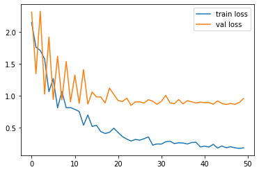
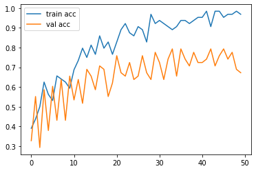

## Transfer Learning VGG 16 and VGG 19 using Keras

Please download the dataset from the below url


```python
# import the libraries as shown below

from tensorflow.keras.layers import Input, Lambda, Dense, Flatten
from tensorflow.keras.models import Model
from tensorflow.keras.applications.resnet50 import ResNet50
#from keras.applications.vgg16 import VGG16
from tensorflow.keras.applications.resnet50 import preprocess_input
from tensorflow.keras.preprocessing import image
from tensorflow.keras.preprocessing.image import ImageDataGenerator,load_img
from tensorflow.keras.models import Sequential
import numpy as np
from glob import glob
import matplotlib.pyplot as plt
```


```python
# re-size all the images to this
IMAGE_SIZE = [224, 224]

train_path = 'Datasets/train'
valid_path = 'Datasets/test'

```


```python
# Import the Vgg 16 library as shown below and add preprocessing layer to the front of VGG
# Here we will be using imagenet weights

resnet = ResNet50(input_shape=IMAGE_SIZE + [3], weights='imagenet', include_top=False)


```

    Downloading data from https://storage.googleapis.com/tensorflow/keras-applications/resnet/resnet50_weights_tf_dim_ordering_tf_kernels_notop.h5
    94773248/94765736 [==============================] - 13s 0us/step
    


```python
# don't train existing weights
for layer in resnet.layers:
    layer.trainable = False
```


```python
  # useful for getting number of output classes
folders = glob('Datasets/train/*')
```


```python
# our layers - you can add more if you want
x = Flatten()(resnet.output)
```


```python
prediction = Dense(len(folders), activation='softmax')(x)

# create a model object
model = Model(inputs=resnet.input, outputs=prediction)
```


```python

# view the structure of the model
model.summary()

```

    Model: "model"
    __________________________________________________________________________________________________
    Layer (type)                    Output Shape         Param #     Connected to                     
    ==================================================================================================
    input_1 (InputLayer)            [(None, 224, 224, 3) 0                                            
    __________________________________________________________________________________________________
    conv1_pad (ZeroPadding2D)       (None, 230, 230, 3)  0           input_1[0][0]                    
    __________________________________________________________________________________________________
    conv1_conv (Conv2D)             (None, 112, 112, 64) 9472        conv1_pad[0][0]                  
    __________________________________________________________________________________________________
    conv1_bn (BatchNormalization)   (None, 112, 112, 64) 256         conv1_conv[0][0]                 
    __________________________________________________________________________________________________
    conv1_relu (Activation)         (None, 112, 112, 64) 0           conv1_bn[0][0]                   
    __________________________________________________________________________________________________
    pool1_pad (ZeroPadding2D)       (None, 114, 114, 64) 0           conv1_relu[0][0]                 
    __________________________________________________________________________________________________
    pool1_pool (MaxPooling2D)       (None, 56, 56, 64)   0           pool1_pad[0][0]                  
    __________________________________________________________________________________________________
    conv2_block1_1_conv (Conv2D)    (None, 56, 56, 64)   4160        pool1_pool[0][0]                 
    __________________________________________________________________________________________________
    conv2_block1_1_bn (BatchNormali (None, 56, 56, 64)   256         conv2_block1_1_conv[0][0]        
    __________________________________________________________________________________________________
    conv2_block1_1_relu (Activation (None, 56, 56, 64)   0           conv2_block1_1_bn[0][0]          
    __________________________________________________________________________________________________
    conv2_block1_2_conv (Conv2D)    (None, 56, 56, 64)   36928       conv2_block1_1_relu[0][0]        
    __________________________________________________________________________________________________
    conv2_block1_2_bn (BatchNormali (None, 56, 56, 64)   256         conv2_block1_2_conv[0][0]        
    __________________________________________________________________________________________________
    conv2_block1_2_relu (Activation (None, 56, 56, 64)   0           conv2_block1_2_bn[0][0]          
    __________________________________________________________________________________________________
    conv2_block1_0_conv (Conv2D)    (None, 56, 56, 256)  16640       pool1_pool[0][0]                 
    __________________________________________________________________________________________________
    conv2_block1_3_conv (Conv2D)    (None, 56, 56, 256)  16640       conv2_block1_2_relu[0][0]        
    __________________________________________________________________________________________________
    conv2_block1_0_bn (BatchNormali (None, 56, 56, 256)  1024        conv2_block1_0_conv[0][0]        
    __________________________________________________________________________________________________
    conv2_block1_3_bn (BatchNormali (None, 56, 56, 256)  1024        conv2_block1_3_conv[0][0]        
    __________________________________________________________________________________________________
    conv2_block1_add (Add)          (None, 56, 56, 256)  0           conv2_block1_0_bn[0][0]          
                                                                     conv2_block1_3_bn[0][0]          
    __________________________________________________________________________________________________
    conv2_block1_out (Activation)   (None, 56, 56, 256)  0           conv2_block1_add[0][0]           
    __________________________________________________________________________________________________
    conv2_block2_1_conv (Conv2D)    (None, 56, 56, 64)   16448       conv2_block1_out[0][0]           
    __________________________________________________________________________________________________
    conv2_block2_1_bn (BatchNormali (None, 56, 56, 64)   256         conv2_block2_1_conv[0][0]        
    __________________________________________________________________________________________________
    conv2_block2_1_relu (Activation (None, 56, 56, 64)   0           conv2_block2_1_bn[0][0]          
    __________________________________________________________________________________________________
    conv2_block2_2_conv (Conv2D)    (None, 56, 56, 64)   36928       conv2_block2_1_relu[0][0]        
    __________________________________________________________________________________________________
    conv2_block2_2_bn (BatchNormali (None, 56, 56, 64)   256         conv2_block2_2_conv[0][0]        
    __________________________________________________________________________________________________
    conv2_block2_2_relu (Activation (None, 56, 56, 64)   0           conv2_block2_2_bn[0][0]          
    __________________________________________________________________________________________________
    conv2_block2_3_conv (Conv2D)    (None, 56, 56, 256)  16640       conv2_block2_2_relu[0][0]        
    __________________________________________________________________________________________________
    conv2_block2_3_bn (BatchNormali (None, 56, 56, 256)  1024        conv2_block2_3_conv[0][0]        
    __________________________________________________________________________________________________
    conv2_block2_add (Add)          (None, 56, 56, 256)  0           conv2_block1_out[0][0]           
                                                                     conv2_block2_3_bn[0][0]          
    __________________________________________________________________________________________________
    conv2_block2_out (Activation)   (None, 56, 56, 256)  0           conv2_block2_add[0][0]           
    __________________________________________________________________________________________________
    conv2_block3_1_conv (Conv2D)    (None, 56, 56, 64)   16448       conv2_block2_out[0][0]           
    __________________________________________________________________________________________________
    conv2_block3_1_bn (BatchNormali (None, 56, 56, 64)   256         conv2_block3_1_conv[0][0]        
    __________________________________________________________________________________________________
    conv2_block3_1_relu (Activation (None, 56, 56, 64)   0           conv2_block3_1_bn[0][0]          
    __________________________________________________________________________________________________
    conv2_block3_2_conv (Conv2D)    (None, 56, 56, 64)   36928       conv2_block3_1_relu[0][0]        
    __________________________________________________________________________________________________
    conv2_block3_2_bn (BatchNormali (None, 56, 56, 64)   256         conv2_block3_2_conv[0][0]        
    __________________________________________________________________________________________________
    conv2_block3_2_relu (Activation (None, 56, 56, 64)   0           conv2_block3_2_bn[0][0]          
    __________________________________________________________________________________________________
    conv2_block3_3_conv (Conv2D)    (None, 56, 56, 256)  16640       conv2_block3_2_relu[0][0]        
    __________________________________________________________________________________________________
    conv2_block3_3_bn (BatchNormali (None, 56, 56, 256)  1024        conv2_block3_3_conv[0][0]        
    __________________________________________________________________________________________________
    conv2_block3_add (Add)          (None, 56, 56, 256)  0           conv2_block2_out[0][0]           
                                                                     conv2_block3_3_bn[0][0]          
    __________________________________________________________________________________________________
    conv2_block3_out (Activation)   (None, 56, 56, 256)  0           conv2_block3_add[0][0]           
    __________________________________________________________________________________________________
    conv3_block1_1_conv (Conv2D)    (None, 28, 28, 128)  32896       conv2_block3_out[0][0]           
    __________________________________________________________________________________________________
    conv3_block1_1_bn (BatchNormali (None, 28, 28, 128)  512         conv3_block1_1_conv[0][0]        
    __________________________________________________________________________________________________
    conv3_block1_1_relu (Activation (None, 28, 28, 128)  0           conv3_block1_1_bn[0][0]          
    __________________________________________________________________________________________________
    conv3_block1_2_conv (Conv2D)    (None, 28, 28, 128)  147584      conv3_block1_1_relu[0][0]        
    __________________________________________________________________________________________________
    conv3_block1_2_bn (BatchNormali (None, 28, 28, 128)  512         conv3_block1_2_conv[0][0]        
    __________________________________________________________________________________________________
    conv3_block1_2_relu (Activation (None, 28, 28, 128)  0           conv3_block1_2_bn[0][0]          
    __________________________________________________________________________________________________
    conv3_block1_0_conv (Conv2D)    (None, 28, 28, 512)  131584      conv2_block3_out[0][0]           
    __________________________________________________________________________________________________
    conv3_block1_3_conv (Conv2D)    (None, 28, 28, 512)  66048       conv3_block1_2_relu[0][0]        
    __________________________________________________________________________________________________
    conv3_block1_0_bn (BatchNormali (None, 28, 28, 512)  2048        conv3_block1_0_conv[0][0]        
    __________________________________________________________________________________________________
    conv3_block1_3_bn (BatchNormali (None, 28, 28, 512)  2048        conv3_block1_3_conv[0][0]        
    __________________________________________________________________________________________________
    conv3_block1_add (Add)          (None, 28, 28, 512)  0           conv3_block1_0_bn[0][0]          
                                                                     conv3_block1_3_bn[0][0]          
    __________________________________________________________________________________________________
    conv3_block1_out (Activation)   (None, 28, 28, 512)  0           conv3_block1_add[0][0]           
    __________________________________________________________________________________________________
    conv3_block2_1_conv (Conv2D)    (None, 28, 28, 128)  65664       conv3_block1_out[0][0]           
    __________________________________________________________________________________________________
    conv3_block2_1_bn (BatchNormali (None, 28, 28, 128)  512         conv3_block2_1_conv[0][0]        
    __________________________________________________________________________________________________
    conv3_block2_1_relu (Activation (None, 28, 28, 128)  0           conv3_block2_1_bn[0][0]          
    __________________________________________________________________________________________________
    conv3_block2_2_conv (Conv2D)    (None, 28, 28, 128)  147584      conv3_block2_1_relu[0][0]        
    __________________________________________________________________________________________________
    conv3_block2_2_bn (BatchNormali (None, 28, 28, 128)  512         conv3_block2_2_conv[0][0]        
    __________________________________________________________________________________________________
    conv3_block2_2_relu (Activation (None, 28, 28, 128)  0           conv3_block2_2_bn[0][0]          
    __________________________________________________________________________________________________
    conv3_block2_3_conv (Conv2D)    (None, 28, 28, 512)  66048       conv3_block2_2_relu[0][0]        
    __________________________________________________________________________________________________
    conv3_block2_3_bn (BatchNormali (None, 28, 28, 512)  2048        conv3_block2_3_conv[0][0]        
    __________________________________________________________________________________________________
    conv3_block2_add (Add)          (None, 28, 28, 512)  0           conv3_block1_out[0][0]           
                                                                     conv3_block2_3_bn[0][0]          
    __________________________________________________________________________________________________
    conv3_block2_out (Activation)   (None, 28, 28, 512)  0           conv3_block2_add[0][0]           
    __________________________________________________________________________________________________
    conv3_block3_1_conv (Conv2D)    (None, 28, 28, 128)  65664       conv3_block2_out[0][0]           
    __________________________________________________________________________________________________
    conv3_block3_1_bn (BatchNormali (None, 28, 28, 128)  512         conv3_block3_1_conv[0][0]        
    __________________________________________________________________________________________________
    conv3_block3_1_relu (Activation (None, 28, 28, 128)  0           conv3_block3_1_bn[0][0]          
    __________________________________________________________________________________________________
    conv3_block3_2_conv (Conv2D)    (None, 28, 28, 128)  147584      conv3_block3_1_relu[0][0]        
    __________________________________________________________________________________________________
    conv3_block3_2_bn (BatchNormali (None, 28, 28, 128)  512         conv3_block3_2_conv[0][0]        
    __________________________________________________________________________________________________
    conv3_block3_2_relu (Activation (None, 28, 28, 128)  0           conv3_block3_2_bn[0][0]          
    __________________________________________________________________________________________________
    conv3_block3_3_conv (Conv2D)    (None, 28, 28, 512)  66048       conv3_block3_2_relu[0][0]        
    __________________________________________________________________________________________________
    conv3_block3_3_bn (BatchNormali (None, 28, 28, 512)  2048        conv3_block3_3_conv[0][0]        
    __________________________________________________________________________________________________
    conv3_block3_add (Add)          (None, 28, 28, 512)  0           conv3_block2_out[0][0]           
                                                                     conv3_block3_3_bn[0][0]          
    __________________________________________________________________________________________________
    conv3_block3_out (Activation)   (None, 28, 28, 512)  0           conv3_block3_add[0][0]           
    __________________________________________________________________________________________________
    conv3_block4_1_conv (Conv2D)    (None, 28, 28, 128)  65664       conv3_block3_out[0][0]           
    __________________________________________________________________________________________________
    conv3_block4_1_bn (BatchNormali (None, 28, 28, 128)  512         conv3_block4_1_conv[0][0]        
    __________________________________________________________________________________________________
    conv3_block4_1_relu (Activation (None, 28, 28, 128)  0           conv3_block4_1_bn[0][0]          
    __________________________________________________________________________________________________
    conv3_block4_2_conv (Conv2D)    (None, 28, 28, 128)  147584      conv3_block4_1_relu[0][0]        
    __________________________________________________________________________________________________
    conv3_block4_2_bn (BatchNormali (None, 28, 28, 128)  512         conv3_block4_2_conv[0][0]        
    __________________________________________________________________________________________________
    conv3_block4_2_relu (Activation (None, 28, 28, 128)  0           conv3_block4_2_bn[0][0]          
    __________________________________________________________________________________________________
    conv3_block4_3_conv (Conv2D)    (None, 28, 28, 512)  66048       conv3_block4_2_relu[0][0]        
    __________________________________________________________________________________________________
    conv3_block4_3_bn (BatchNormali (None, 28, 28, 512)  2048        conv3_block4_3_conv[0][0]        
    __________________________________________________________________________________________________
    conv3_block4_add (Add)          (None, 28, 28, 512)  0           conv3_block3_out[0][0]           
                                                                     conv3_block4_3_bn[0][0]          
    __________________________________________________________________________________________________
    conv3_block4_out (Activation)   (None, 28, 28, 512)  0           conv3_block4_add[0][0]           
    __________________________________________________________________________________________________
    conv4_block1_1_conv (Conv2D)    (None, 14, 14, 256)  131328      conv3_block4_out[0][0]           
    __________________________________________________________________________________________________
    conv4_block1_1_bn (BatchNormali (None, 14, 14, 256)  1024        conv4_block1_1_conv[0][0]        
    __________________________________________________________________________________________________
    conv4_block1_1_relu (Activation (None, 14, 14, 256)  0           conv4_block1_1_bn[0][0]          
    __________________________________________________________________________________________________
    conv4_block1_2_conv (Conv2D)    (None, 14, 14, 256)  590080      conv4_block1_1_relu[0][0]        
    __________________________________________________________________________________________________
    conv4_block1_2_bn (BatchNormali (None, 14, 14, 256)  1024        conv4_block1_2_conv[0][0]        
    __________________________________________________________________________________________________
    conv4_block1_2_relu (Activation (None, 14, 14, 256)  0           conv4_block1_2_bn[0][0]          
    __________________________________________________________________________________________________
    conv4_block1_0_conv (Conv2D)    (None, 14, 14, 1024) 525312      conv3_block4_out[0][0]           
    __________________________________________________________________________________________________
    conv4_block1_3_conv (Conv2D)    (None, 14, 14, 1024) 263168      conv4_block1_2_relu[0][0]        
    __________________________________________________________________________________________________
    conv4_block1_0_bn (BatchNormali (None, 14, 14, 1024) 4096        conv4_block1_0_conv[0][0]        
    __________________________________________________________________________________________________
    conv4_block1_3_bn (BatchNormali (None, 14, 14, 1024) 4096        conv4_block1_3_conv[0][0]        
    __________________________________________________________________________________________________
    conv4_block1_add (Add)          (None, 14, 14, 1024) 0           conv4_block1_0_bn[0][0]          
                                                                     conv4_block1_3_bn[0][0]          
    __________________________________________________________________________________________________
    conv4_block1_out (Activation)   (None, 14, 14, 1024) 0           conv4_block1_add[0][0]           
    __________________________________________________________________________________________________
    conv4_block2_1_conv (Conv2D)    (None, 14, 14, 256)  262400      conv4_block1_out[0][0]           
    __________________________________________________________________________________________________
    conv4_block2_1_bn (BatchNormali (None, 14, 14, 256)  1024        conv4_block2_1_conv[0][0]        
    __________________________________________________________________________________________________
    conv4_block2_1_relu (Activation (None, 14, 14, 256)  0           conv4_block2_1_bn[0][0]          
    __________________________________________________________________________________________________
    conv4_block2_2_conv (Conv2D)    (None, 14, 14, 256)  590080      conv4_block2_1_relu[0][0]        
    __________________________________________________________________________________________________
    conv4_block2_2_bn (BatchNormali (None, 14, 14, 256)  1024        conv4_block2_2_conv[0][0]        
    __________________________________________________________________________________________________
    conv4_block2_2_relu (Activation (None, 14, 14, 256)  0           conv4_block2_2_bn[0][0]          
    __________________________________________________________________________________________________
    conv4_block2_3_conv (Conv2D)    (None, 14, 14, 1024) 263168      conv4_block2_2_relu[0][0]        
    __________________________________________________________________________________________________
    conv4_block2_3_bn (BatchNormali (None, 14, 14, 1024) 4096        conv4_block2_3_conv[0][0]        
    __________________________________________________________________________________________________
    conv4_block2_add (Add)          (None, 14, 14, 1024) 0           conv4_block1_out[0][0]           
                                                                     conv4_block2_3_bn[0][0]          
    __________________________________________________________________________________________________
    conv4_block2_out (Activation)   (None, 14, 14, 1024) 0           conv4_block2_add[0][0]           
    __________________________________________________________________________________________________
    conv4_block3_1_conv (Conv2D)    (None, 14, 14, 256)  262400      conv4_block2_out[0][0]           
    __________________________________________________________________________________________________
    conv4_block3_1_bn (BatchNormali (None, 14, 14, 256)  1024        conv4_block3_1_conv[0][0]        
    __________________________________________________________________________________________________
    conv4_block3_1_relu (Activation (None, 14, 14, 256)  0           conv4_block3_1_bn[0][0]          
    __________________________________________________________________________________________________
    conv4_block3_2_conv (Conv2D)    (None, 14, 14, 256)  590080      conv4_block3_1_relu[0][0]        
    __________________________________________________________________________________________________
    conv4_block3_2_bn (BatchNormali (None, 14, 14, 256)  1024        conv4_block3_2_conv[0][0]        
    __________________________________________________________________________________________________
    conv4_block3_2_relu (Activation (None, 14, 14, 256)  0           conv4_block3_2_bn[0][0]          
    __________________________________________________________________________________________________
    conv4_block3_3_conv (Conv2D)    (None, 14, 14, 1024) 263168      conv4_block3_2_relu[0][0]        
    __________________________________________________________________________________________________
    conv4_block3_3_bn (BatchNormali (None, 14, 14, 1024) 4096        conv4_block3_3_conv[0][0]        
    __________________________________________________________________________________________________
    conv4_block3_add (Add)          (None, 14, 14, 1024) 0           conv4_block2_out[0][0]           
                                                                     conv4_block3_3_bn[0][0]          
    __________________________________________________________________________________________________
    conv4_block3_out (Activation)   (None, 14, 14, 1024) 0           conv4_block3_add[0][0]           
    __________________________________________________________________________________________________
    conv4_block4_1_conv (Conv2D)    (None, 14, 14, 256)  262400      conv4_block3_out[0][0]           
    __________________________________________________________________________________________________
    conv4_block4_1_bn (BatchNormali (None, 14, 14, 256)  1024        conv4_block4_1_conv[0][0]        
    __________________________________________________________________________________________________
    conv4_block4_1_relu (Activation (None, 14, 14, 256)  0           conv4_block4_1_bn[0][0]          
    __________________________________________________________________________________________________
    conv4_block4_2_conv (Conv2D)    (None, 14, 14, 256)  590080      conv4_block4_1_relu[0][0]        
    __________________________________________________________________________________________________
    conv4_block4_2_bn (BatchNormali (None, 14, 14, 256)  1024        conv4_block4_2_conv[0][0]        
    __________________________________________________________________________________________________
    conv4_block4_2_relu (Activation (None, 14, 14, 256)  0           conv4_block4_2_bn[0][0]          
    __________________________________________________________________________________________________
    conv4_block4_3_conv (Conv2D)    (None, 14, 14, 1024) 263168      conv4_block4_2_relu[0][0]        
    __________________________________________________________________________________________________
    conv4_block4_3_bn (BatchNormali (None, 14, 14, 1024) 4096        conv4_block4_3_conv[0][0]        
    __________________________________________________________________________________________________
    conv4_block4_add (Add)          (None, 14, 14, 1024) 0           conv4_block3_out[0][0]           
                                                                     conv4_block4_3_bn[0][0]          
    __________________________________________________________________________________________________
    conv4_block4_out (Activation)   (None, 14, 14, 1024) 0           conv4_block4_add[0][0]           
    __________________________________________________________________________________________________
    conv4_block5_1_conv (Conv2D)    (None, 14, 14, 256)  262400      conv4_block4_out[0][0]           
    __________________________________________________________________________________________________
    conv4_block5_1_bn (BatchNormali (None, 14, 14, 256)  1024        conv4_block5_1_conv[0][0]        
    __________________________________________________________________________________________________
    conv4_block5_1_relu (Activation (None, 14, 14, 256)  0           conv4_block5_1_bn[0][0]          
    __________________________________________________________________________________________________
    conv4_block5_2_conv (Conv2D)    (None, 14, 14, 256)  590080      conv4_block5_1_relu[0][0]        
    __________________________________________________________________________________________________
    conv4_block5_2_bn (BatchNormali (None, 14, 14, 256)  1024        conv4_block5_2_conv[0][0]        
    __________________________________________________________________________________________________
    conv4_block5_2_relu (Activation (None, 14, 14, 256)  0           conv4_block5_2_bn[0][0]          
    __________________________________________________________________________________________________
    conv4_block5_3_conv (Conv2D)    (None, 14, 14, 1024) 263168      conv4_block5_2_relu[0][0]        
    __________________________________________________________________________________________________
    conv4_block5_3_bn (BatchNormali (None, 14, 14, 1024) 4096        conv4_block5_3_conv[0][0]        
    __________________________________________________________________________________________________
    conv4_block5_add (Add)          (None, 14, 14, 1024) 0           conv4_block4_out[0][0]           
                                                                     conv4_block5_3_bn[0][0]          
    __________________________________________________________________________________________________
    conv4_block5_out (Activation)   (None, 14, 14, 1024) 0           conv4_block5_add[0][0]           
    __________________________________________________________________________________________________
    conv4_block6_1_conv (Conv2D)    (None, 14, 14, 256)  262400      conv4_block5_out[0][0]           
    __________________________________________________________________________________________________
    conv4_block6_1_bn (BatchNormali (None, 14, 14, 256)  1024        conv4_block6_1_conv[0][0]        
    __________________________________________________________________________________________________
    conv4_block6_1_relu (Activation (None, 14, 14, 256)  0           conv4_block6_1_bn[0][0]          
    __________________________________________________________________________________________________
    conv4_block6_2_conv (Conv2D)    (None, 14, 14, 256)  590080      conv4_block6_1_relu[0][0]        
    __________________________________________________________________________________________________
    conv4_block6_2_bn (BatchNormali (None, 14, 14, 256)  1024        conv4_block6_2_conv[0][0]        
    __________________________________________________________________________________________________
    conv4_block6_2_relu (Activation (None, 14, 14, 256)  0           conv4_block6_2_bn[0][0]          
    __________________________________________________________________________________________________
    conv4_block6_3_conv (Conv2D)    (None, 14, 14, 1024) 263168      conv4_block6_2_relu[0][0]        
    __________________________________________________________________________________________________
    conv4_block6_3_bn (BatchNormali (None, 14, 14, 1024) 4096        conv4_block6_3_conv[0][0]        
    __________________________________________________________________________________________________
    conv4_block6_add (Add)          (None, 14, 14, 1024) 0           conv4_block5_out[0][0]           
                                                                     conv4_block6_3_bn[0][0]          
    __________________________________________________________________________________________________
    conv4_block6_out (Activation)   (None, 14, 14, 1024) 0           conv4_block6_add[0][0]           
    __________________________________________________________________________________________________
    conv5_block1_1_conv (Conv2D)    (None, 7, 7, 512)    524800      conv4_block6_out[0][0]           
    __________________________________________________________________________________________________
    conv5_block1_1_bn (BatchNormali (None, 7, 7, 512)    2048        conv5_block1_1_conv[0][0]        
    __________________________________________________________________________________________________
    conv5_block1_1_relu (Activation (None, 7, 7, 512)    0           conv5_block1_1_bn[0][0]          
    __________________________________________________________________________________________________
    conv5_block1_2_conv (Conv2D)    (None, 7, 7, 512)    2359808     conv5_block1_1_relu[0][0]        
    __________________________________________________________________________________________________
    conv5_block1_2_bn (BatchNormali (None, 7, 7, 512)    2048        conv5_block1_2_conv[0][0]        
    __________________________________________________________________________________________________
    conv5_block1_2_relu (Activation (None, 7, 7, 512)    0           conv5_block1_2_bn[0][0]          
    __________________________________________________________________________________________________
    conv5_block1_0_conv (Conv2D)    (None, 7, 7, 2048)   2099200     conv4_block6_out[0][0]           
    __________________________________________________________________________________________________
    conv5_block1_3_conv (Conv2D)    (None, 7, 7, 2048)   1050624     conv5_block1_2_relu[0][0]        
    __________________________________________________________________________________________________
    conv5_block1_0_bn (BatchNormali (None, 7, 7, 2048)   8192        conv5_block1_0_conv[0][0]        
    __________________________________________________________________________________________________
    conv5_block1_3_bn (BatchNormali (None, 7, 7, 2048)   8192        conv5_block1_3_conv[0][0]        
    __________________________________________________________________________________________________
    conv5_block1_add (Add)          (None, 7, 7, 2048)   0           conv5_block1_0_bn[0][0]          
                                                                     conv5_block1_3_bn[0][0]          
    __________________________________________________________________________________________________
    conv5_block1_out (Activation)   (None, 7, 7, 2048)   0           conv5_block1_add[0][0]           
    __________________________________________________________________________________________________
    conv5_block2_1_conv (Conv2D)    (None, 7, 7, 512)    1049088     conv5_block1_out[0][0]           
    __________________________________________________________________________________________________
    conv5_block2_1_bn (BatchNormali (None, 7, 7, 512)    2048        conv5_block2_1_conv[0][0]        
    __________________________________________________________________________________________________
    conv5_block2_1_relu (Activation (None, 7, 7, 512)    0           conv5_block2_1_bn[0][0]          
    __________________________________________________________________________________________________
    conv5_block2_2_conv (Conv2D)    (None, 7, 7, 512)    2359808     conv5_block2_1_relu[0][0]        
    __________________________________________________________________________________________________
    conv5_block2_2_bn (BatchNormali (None, 7, 7, 512)    2048        conv5_block2_2_conv[0][0]        
    __________________________________________________________________________________________________
    conv5_block2_2_relu (Activation (None, 7, 7, 512)    0           conv5_block2_2_bn[0][0]          
    __________________________________________________________________________________________________
    conv5_block2_3_conv (Conv2D)    (None, 7, 7, 2048)   1050624     conv5_block2_2_relu[0][0]        
    __________________________________________________________________________________________________
    conv5_block2_3_bn (BatchNormali (None, 7, 7, 2048)   8192        conv5_block2_3_conv[0][0]        
    __________________________________________________________________________________________________
    conv5_block2_add (Add)          (None, 7, 7, 2048)   0           conv5_block1_out[0][0]           
                                                                     conv5_block2_3_bn[0][0]          
    __________________________________________________________________________________________________
    conv5_block2_out (Activation)   (None, 7, 7, 2048)   0           conv5_block2_add[0][0]           
    __________________________________________________________________________________________________
    conv5_block3_1_conv (Conv2D)    (None, 7, 7, 512)    1049088     conv5_block2_out[0][0]           
    __________________________________________________________________________________________________
    conv5_block3_1_bn (BatchNormali (None, 7, 7, 512)    2048        conv5_block3_1_conv[0][0]        
    __________________________________________________________________________________________________
    conv5_block3_1_relu (Activation (None, 7, 7, 512)    0           conv5_block3_1_bn[0][0]          
    __________________________________________________________________________________________________
    conv5_block3_2_conv (Conv2D)    (None, 7, 7, 512)    2359808     conv5_block3_1_relu[0][0]        
    __________________________________________________________________________________________________
    conv5_block3_2_bn (BatchNormali (None, 7, 7, 512)    2048        conv5_block3_2_conv[0][0]        
    __________________________________________________________________________________________________
    conv5_block3_2_relu (Activation (None, 7, 7, 512)    0           conv5_block3_2_bn[0][0]          
    __________________________________________________________________________________________________
    conv5_block3_3_conv (Conv2D)    (None, 7, 7, 2048)   1050624     conv5_block3_2_relu[0][0]        
    __________________________________________________________________________________________________
    conv5_block3_3_bn (BatchNormali (None, 7, 7, 2048)   8192        conv5_block3_3_conv[0][0]        
    __________________________________________________________________________________________________
    conv5_block3_add (Add)          (None, 7, 7, 2048)   0           conv5_block2_out[0][0]           
                                                                     conv5_block3_3_bn[0][0]          
    __________________________________________________________________________________________________
    conv5_block3_out (Activation)   (None, 7, 7, 2048)   0           conv5_block3_add[0][0]           
    __________________________________________________________________________________________________
    flatten (Flatten)               (None, 100352)       0           conv5_block3_out[0][0]           
    __________________________________________________________________________________________________
    dense (Dense)                   (None, 3)            301059      flatten[0][0]                    
    ==================================================================================================
    Total params: 23,888,771
    Trainable params: 301,059
    Non-trainable params: 23,587,712
    __________________________________________________________________________________________________
    


```python
# tell the model what cost and optimization method to use
model.compile(
  loss='categorical_crossentropy',
  optimizer='adam',
  metrics=['accuracy']
)

```


```python
# Use the Image Data Generator to import the images from the dataset
from tensorflow.keras.preprocessing.image import ImageDataGenerator

train_datagen = ImageDataGenerator(rescale = 1./255,
                                   shear_range = 0.2,
                                   zoom_range = 0.2,
                                   horizontal_flip = True)

test_datagen = ImageDataGenerator(rescale = 1./255)
```


```python
# Make sure you provide the same target size as initialied for the image size
training_set = train_datagen.flow_from_directory('Datasets/train',
                                                 target_size = (224, 224),
                                                 batch_size = 32,
                                                 class_mode = 'categorical')
```

    Found 64 images belonging to 3 classes.
    


```python
test_set = test_datagen.flow_from_directory('Datasets/test',
                                            target_size = (224, 224),
                                            batch_size = 32,
                                            class_mode = 'categorical')
```

    Found 58 images belonging to 3 classes.
    


```python
# fit the model
# Run the cell. It will take some time to execute
r = model.fit_generator(
  training_set,
  validation_data=test_set,
  epochs=50,
  steps_per_epoch=len(training_set),
  validation_steps=len(test_set)
)
```

    Epoch 1/50
    2/2 [==============================] - 3s 2s/step - loss: 2.1465 - accuracy: 0.3906 - val_loss: 2.3110 - val_accuracy: 0.3276
    Epoch 2/50
    2/2 [==============================] - 3s 2s/step - loss: 1.7622 - accuracy: 0.4375 - val_loss: 1.3440 - val_accuracy: 0.5517
    Epoch 3/50
    2/2 [==============================] - 3s 2s/step - loss: 1.7097 - accuracy: 0.5000 - val_loss: 2.3233 - val_accuracy: 0.2931
    Epoch 4/50
    2/2 [==============================] - 3s 2s/step - loss: 1.5772 - accuracy: 0.6250 - val_loss: 1.0259 - val_accuracy: 0.5862
    Epoch 5/50
    2/2 [==============================] - 3s 2s/step - loss: 1.0635 - accuracy: 0.5625 - val_loss: 1.9196 - val_accuracy: 0.3793
    Epoch 6/50
    2/2 [==============================] - 3s 2s/step - loss: 1.2690 - accuracy: 0.5312 - val_loss: 0.9411 - val_accuracy: 0.6034
    Epoch 7/50
    2/2 [==============================] - 3s 2s/step - loss: 0.8099 - accuracy: 0.6562 - val_loss: 1.6190 - val_accuracy: 0.4310
    Epoch 8/50
    2/2 [==============================] - 4s 2s/step - loss: 1.0676 - accuracy: 0.6406 - val_loss: 0.9343 - val_accuracy: 0.6379
    Epoch 9/50
    2/2 [==============================] - 3s 2s/step - loss: 0.8109 - accuracy: 0.6250 - val_loss: 1.5371 - val_accuracy: 0.4310
    Epoch 10/50
    2/2 [==============================] - 3s 2s/step - loss: 0.8141 - accuracy: 0.5938 - val_loss: 0.9046 - val_accuracy: 0.6552
    Epoch 11/50
    2/2 [==============================] - 4s 2s/step - loss: 0.7862 - accuracy: 0.6875 - val_loss: 1.3242 - val_accuracy: 0.5345
    Epoch 12/50
    2/2 [==============================] - 3s 2s/step - loss: 0.7538 - accuracy: 0.7344 - val_loss: 0.8791 - val_accuracy: 0.6379
    Epoch 13/50
    2/2 [==============================] - 3s 2s/step - loss: 0.5382 - accuracy: 0.7969 - val_loss: 1.4106 - val_accuracy: 0.5172
    Epoch 14/50
    2/2 [==============================] - 3s 2s/step - loss: 0.6974 - accuracy: 0.7500 - val_loss: 0.8693 - val_accuracy: 0.6897
    Epoch 15/50
    2/2 [==============================] - 3s 2s/step - loss: 0.5191 - accuracy: 0.8125 - val_loss: 1.0579 - val_accuracy: 0.6552
    Epoch 16/50
    2/2 [==============================] - 3s 2s/step - loss: 0.5365 - accuracy: 0.7656 - val_loss: 0.9813 - val_accuracy: 0.5862
    Epoch 17/50
    2/2 [==============================] - 3s 2s/step - loss: 0.4379 - accuracy: 0.8594 - val_loss: 0.9801 - val_accuracy: 0.7069
    Epoch 18/50
    2/2 [==============================] - 3s 2s/step - loss: 0.4083 - accuracy: 0.7969 - val_loss: 0.8875 - val_accuracy: 0.6897
    Epoch 19/50
    2/2 [==============================] - 4s 2s/step - loss: 0.4269 - accuracy: 0.8281 - val_loss: 1.1200 - val_accuracy: 0.5517
    Epoch 20/50
    2/2 [==============================] - 3s 2s/step - loss: 0.4920 - accuracy: 0.7656 - val_loss: 1.0208 - val_accuracy: 0.6207
    Epoch 21/50
    2/2 [==============================] - 3s 2s/step - loss: 0.4241 - accuracy: 0.8281 - val_loss: 0.9244 - val_accuracy: 0.7586
    Epoch 22/50
    2/2 [==============================] - 4s 2s/step - loss: 0.3602 - accuracy: 0.8906 - val_loss: 0.9097 - val_accuracy: 0.6724
    Epoch 23/50
    2/2 [==============================] - 3s 2s/step - loss: 0.3204 - accuracy: 0.9219 - val_loss: 0.9617 - val_accuracy: 0.6552
    Epoch 24/50
    2/2 [==============================] - 4s 2s/step - loss: 0.2908 - accuracy: 0.8750 - val_loss: 0.8495 - val_accuracy: 0.7241
    Epoch 25/50
    2/2 [==============================] - 3s 2s/step - loss: 0.3152 - accuracy: 0.8594 - val_loss: 0.9041 - val_accuracy: 0.6379
    Epoch 26/50
    2/2 [==============================] - 3s 2s/step - loss: 0.3042 - accuracy: 0.9062 - val_loss: 0.9042 - val_accuracy: 0.6552
    Epoch 27/50
    2/2 [==============================] - 3s 2s/step - loss: 0.3266 - accuracy: 0.8906 - val_loss: 0.8855 - val_accuracy: 0.7586
    Epoch 28/50
    2/2 [==============================] - 4s 2s/step - loss: 0.3547 - accuracy: 0.8281 - val_loss: 0.9379 - val_accuracy: 0.6724
    Epoch 29/50
    2/2 [==============================] - 4s 2s/step - loss: 0.2268 - accuracy: 0.9688 - val_loss: 0.9147 - val_accuracy: 0.6379
    Epoch 30/50
    2/2 [==============================] - 3s 2s/step - loss: 0.2449 - accuracy: 0.9219 - val_loss: 0.8657 - val_accuracy: 0.7759
    Epoch 31/50
    2/2 [==============================] - 3s 2s/step - loss: 0.2425 - accuracy: 0.9375 - val_loss: 0.9107 - val_accuracy: 0.7241
    Epoch 32/50
    2/2 [==============================] - 3s 2s/step - loss: 0.2787 - accuracy: 0.9219 - val_loss: 1.0061 - val_accuracy: 0.6379
    Epoch 33/50
    2/2 [==============================] - 4s 2s/step - loss: 0.2874 - accuracy: 0.9062 - val_loss: 0.8881 - val_accuracy: 0.7414
    Epoch 34/50
    2/2 [==============================] - 4s 2s/step - loss: 0.2507 - accuracy: 0.8906 - val_loss: 0.8742 - val_accuracy: 0.7931
    Epoch 35/50
    2/2 [==============================] - 4s 2s/step - loss: 0.2626 - accuracy: 0.9062 - val_loss: 0.9400 - val_accuracy: 0.6552
    Epoch 36/50
    2/2 [==============================] - 4s 2s/step - loss: 0.2597 - accuracy: 0.9375 - val_loss: 0.8724 - val_accuracy: 0.7931
    Epoch 37/50
    2/2 [==============================] - 4s 2s/step - loss: 0.2440 - accuracy: 0.9375 - val_loss: 0.9215 - val_accuracy: 0.7414
    Epoch 38/50
    2/2 [==============================] - 4s 2s/step - loss: 0.2671 - accuracy: 0.9219 - val_loss: 0.9050 - val_accuracy: 0.7069
    Epoch 39/50
    2/2 [==============================] - 4s 2s/step - loss: 0.2714 - accuracy: 0.9375 - val_loss: 0.8864 - val_accuracy: 0.7759
    Epoch 40/50
    2/2 [==============================] - 4s 2s/step - loss: 0.1975 - accuracy: 0.9531 - val_loss: 0.8993 - val_accuracy: 0.7241
    Epoch 41/50
    2/2 [==============================] - 4s 2s/step - loss: 0.2094 - accuracy: 0.9531 - val_loss: 0.8919 - val_accuracy: 0.7241
    Epoch 42/50
    2/2 [==============================] - 4s 2s/step - loss: 0.1953 - accuracy: 0.9844 - val_loss: 0.8946 - val_accuracy: 0.7414
    Epoch 43/50
    2/2 [==============================] - 3s 2s/step - loss: 0.2388 - accuracy: 0.9062 - val_loss: 0.8665 - val_accuracy: 0.7931
    Epoch 44/50
    2/2 [==============================] - 3s 2s/step - loss: 0.1809 - accuracy: 0.9844 - val_loss: 0.9195 - val_accuracy: 0.7069
    Epoch 45/50
    2/2 [==============================] - 3s 2s/step - loss: 0.2123 - accuracy: 0.9844 - val_loss: 0.8800 - val_accuracy: 0.7586
    Epoch 46/50
    2/2 [==============================] - 4s 2s/step - loss: 0.1852 - accuracy: 0.9531 - val_loss: 0.8629 - val_accuracy: 0.7931
    Epoch 47/50
    2/2 [==============================] - 4s 2s/step - loss: 0.2014 - accuracy: 0.9688 - val_loss: 0.8797 - val_accuracy: 0.7414
    Epoch 48/50
    2/2 [==============================] - 4s 2s/step - loss: 0.1845 - accuracy: 0.9688 - val_loss: 0.8646 - val_accuracy: 0.7759
    Epoch 49/50
    2/2 [==============================] - 4s 2s/step - loss: 0.1754 - accuracy: 0.9844 - val_loss: 0.8934 - val_accuracy: 0.6897
    Epoch 50/50
    2/2 [==============================] - 3s 2s/step - loss: 0.1830 - accuracy: 0.9688 - val_loss: 0.9548 - val_accuracy: 0.6724
    


```python

```


```python
# plot the loss
plt.plot(r.history['loss'], label='train loss')
plt.plot(r.history['val_loss'], label='val loss')
plt.legend()
plt.show()
plt.savefig('LossVal_loss')

# plot the accuracy
plt.plot(r.history['accuracy'], label='train acc')
plt.plot(r.history['val_accuracy'], label='val acc')
plt.legend()
plt.show()
plt.savefig('AccVal_acc')
```


    

    


    

    


    <Figure size 432x288 with 0 Axes>


```python
# save it as a h5 file


from tensorflow.keras.models import load_model

model.save('model_resnet50.h5')
```


```python

```


```python

y_pred = model.predict(test_set)

```


```python
y_pred
```


    array([[2.73187868e-02, 6.35943949e-01, 3.36737245e-01],
           [5.32117963e-01, 4.06336963e-01, 6.15450703e-02],
           [2.18244940e-01, 1.21792853e-01, 6.59962177e-01],
           [7.13846564e-01, 6.96882829e-02, 2.16465190e-01],
           [8.45080912e-02, 1.32538576e-03, 9.14166570e-01],
           [1.12954237e-01, 8.64453554e-01, 2.25921888e-02],
           [5.32363169e-02, 7.21089959e-01, 2.25673750e-01],
           [2.26125740e-05, 8.14217638e-05, 9.99895930e-01],
           [4.68579568e-02, 9.51322854e-01, 1.81910372e-03],
           [2.18738019e-02, 1.25456427e-03, 9.76871669e-01],
           [4.89251651e-02, 8.53239179e-01, 9.78356451e-02],
           [3.28370333e-02, 2.36797822e-03, 9.64794993e-01],
           [8.04440752e-02, 2.88622886e-01, 6.30933046e-01],
           [3.90192628e-01, 2.33580455e-01, 3.76226962e-01],
           [1.83415916e-02, 9.48268533e-01, 3.33898999e-02],
           [2.41261408e-01, 4.27105606e-01, 3.31632912e-01],
           [8.70700061e-01, 3.90547724e-03, 1.25394493e-01],
           [6.43375870e-06, 4.48106090e-04, 9.99545395e-01],
           [2.33309418e-02, 8.75707209e-01, 1.00961827e-01],
           [1.68869123e-01, 2.18794703e-01, 6.12336218e-01],
           [1.15046855e-02, 9.62082505e-01, 2.64127720e-02],
           [1.60634935e-01, 9.96036083e-03, 8.29404652e-01],
           [2.98359673e-02, 7.91092038e-01, 1.79071948e-01],
           [9.43630576e-01, 5.38715646e-02, 2.49781809e-03],
           [3.87979671e-02, 1.11808345e-01, 8.49393725e-01],
           [6.32739335e-04, 9.90709186e-01, 8.65799095e-03],
           [4.13829535e-02, 8.79822254e-01, 7.87948146e-02],
           [1.21594861e-01, 5.69236353e-02, 8.21481526e-01],
           [9.52745974e-01, 2.06574630e-02, 2.65965573e-02],
           [9.95284989e-02, 5.68932652e-01, 3.31538826e-01],
           [3.69348004e-02, 4.25086558e-01, 5.37978649e-01],
           [6.96831420e-02, 5.82942273e-03, 9.24487352e-01],
           [9.27041247e-02, 2.95088857e-01, 6.12207055e-01],
           [6.71517432e-01, 1.26601681e-01, 2.01880947e-01],
           [1.10414894e-02, 8.96534026e-01, 9.24245268e-02],
           [4.14094180e-02, 2.53581256e-01, 7.05009341e-01],
           [5.02322521e-03, 9.86167133e-01, 8.80967174e-03],
           [1.02342203e-01, 1.82328047e-04, 8.97475481e-01],
           [3.22725862e-01, 4.01354134e-01, 2.75920063e-01],
           [9.67599332e-01, 1.08619370e-02, 2.15387065e-02],
           [2.16640588e-02, 3.52164507e-01, 6.26171410e-01],
           [3.57131124e-01, 4.38901097e-01, 2.03967765e-01],
           [6.37840211e-01, 3.41039225e-02, 3.28055769e-01],
           [6.02720715e-02, 7.00991988e-01, 2.38735929e-01],
           [4.69329627e-03, 9.39610958e-01, 5.56956455e-02],
           [2.43041408e-03, 6.82524204e-01, 3.15045387e-01],
           [4.87683788e-02, 4.26231205e-01, 5.25000334e-01],
           [9.68200490e-02, 5.10944575e-02, 8.52085531e-01],
           [8.17427486e-02, 2.78275937e-01, 6.39981270e-01],
           [5.72731299e-03, 1.34207653e-02, 9.80851948e-01],
           [9.86407876e-01, 4.04018769e-03, 9.55183804e-03],
           [5.57873435e-02, 1.78392574e-01, 7.65820086e-01],
           [1.04311565e-02, 3.71323347e-01, 6.18245482e-01],
           [1.09694548e-01, 2.29822338e-01, 6.60483122e-01],
           [5.56478053e-02, 1.09311447e-01, 8.35040748e-01],
           [8.33302021e-01, 1.05132543e-01, 6.15654588e-02],
           [3.20118934e-01, 2.38704294e-01, 4.41176802e-01],
           [1.08633913e-01, 6.76979959e-01, 2.14386165e-01]], dtype=float32)


```python
import numpy as np
y_pred = np.argmax(y_pred, axis=1)
```


```python
y_pred
```


    array([1, 0, 2, 0, 2, 1, 1, 2, 1, 2, 1, 2, 2, 0, 1, 1, 0, 2, 1, 2, 1, 2,
           1, 0, 2, 1, 1, 2, 0, 1, 2, 2, 2, 0, 1, 2, 1, 2, 1, 0, 2, 1, 0, 1,
           1, 1, 2, 2, 2, 2, 0, 2, 2, 2, 2, 0, 2, 1], dtype=int64)


```python

```


```python
from tensorflow.keras.models import load_model
from tensorflow.keras.preprocessing import image
```


```python
model=load_model('model_resnet50.h5')
```


```python
img_data
```


    array([[[[ 6.7060997e+01,  5.4221001e+01,  4.7320000e+01],
             [ 6.9060997e+01,  5.6221001e+01,  4.9320000e+01],
             [ 7.3060997e+01,  6.0221001e+01,  5.3320000e+01],
             ...,
             [ 7.4060997e+01,  5.6221001e+01,  4.6320000e+01],
             [ 5.5060997e+01,  3.7221001e+01,  2.7320000e+01],
             [ 4.1060997e+01,  2.3221001e+01,  1.3320000e+01]],
    
            [[ 7.5060997e+01,  6.2221001e+01,  5.5320000e+01],
             [ 7.8060997e+01,  6.5221001e+01,  5.8320000e+01],
             [ 8.1060997e+01,  6.8221001e+01,  6.1320000e+01],
             ...,
             [ 9.7060997e+01,  7.9221001e+01,  6.9320000e+01],
             [ 7.3060997e+01,  5.5221001e+01,  4.5320000e+01],
             [ 4.9060997e+01,  3.1221001e+01,  2.1320000e+01]],
    
            [[ 8.7060997e+01,  7.4221001e+01,  6.7320000e+01],
             [ 9.0060997e+01,  7.7221001e+01,  7.0320000e+01],
             [ 9.3060997e+01,  8.0221001e+01,  7.3320000e+01],
             ...,
             [ 1.0106100e+02,  8.3221001e+01,  7.3320000e+01],
             [ 7.5060997e+01,  5.7221001e+01,  4.7320000e+01],
             [ 5.0060997e+01,  3.2221001e+01,  2.2320000e+01]],
    
            ...,
    
            [[ 1.0406100e+02,  8.9221001e+01,  9.4320000e+01],
             [ 1.0206100e+02,  8.7221001e+01,  9.2320000e+01],
             [ 9.9060997e+01,  8.4221001e+01,  8.9320000e+01],
             ...,
             [-1.0939003e+01, -1.6778999e+01, -1.4680000e+01],
             [-1.0939003e+01, -1.6778999e+01, -1.4680000e+01],
             [-1.0939003e+01, -1.6778999e+01, -1.4680000e+01]],
    
            [[ 1.0606100e+02,  9.1221001e+01,  9.6320000e+01],
             [ 1.0406100e+02,  8.9221001e+01,  9.4320000e+01],
             [ 1.0006100e+02,  8.5221001e+01,  9.0320000e+01],
             ...,
             [-5.9390030e+00, -1.1778999e+01, -9.6800003e+00],
             [-5.9390030e+00, -1.1778999e+01, -9.6800003e+00],
             [-5.9390030e+00, -1.1778999e+01, -9.6800003e+00]],
    
            [[ 1.0806100e+02,  9.4221001e+01,  9.6320000e+01],
             [ 1.0606100e+02,  9.2221001e+01,  9.4320000e+01],
             [ 1.0206100e+02,  8.8221001e+01,  9.0320000e+01],
             ...,
             [ 6.0997009e-02, -5.7789993e+00, -3.6800003e+00],
             [ 6.0997009e-02, -5.7789993e+00, -3.6800003e+00],
             [ 6.0997009e-02, -5.7789993e+00, -3.6800003e+00]]]],
          dtype=float32)


```python
img=image.load_img('Datasets/Test/lamborghini/11.jpg',target_size=(224,224))


```


```python
x=image.img_to_array(img)
x
```


    array([[[252., 252., 252.],
            [252., 252., 252.],
            [252., 252., 252.],
            ...,
            [194., 188., 174.],
            [215., 209., 197.],
            [241., 235., 223.]],
    
           [[252., 252., 252.],
            [252., 252., 252.],
            [252., 252., 252.],
            ...,
            [247., 245., 233.],
            [245., 242., 233.],
            [244., 241., 232.]],
    
           [[252., 252., 252.],
            [252., 252., 252.],
            [252., 252., 252.],
            ...,
            [245., 248., 241.],
            [244., 250., 248.],
            [244., 250., 248.]],
    
           ...,
    
           [[190., 206., 229.],
            [190., 206., 229.],
            [190., 206., 229.],
            ...,
            [172., 179., 187.],
            [171., 180., 187.],
            [171., 180., 187.]],
    
           [[187., 205., 227.],
            [187., 205., 227.],
            [187., 205., 227.],
            ...,
            [172., 179., 187.],
            [171., 180., 187.],
            [171., 180., 187.]],
    
           [[185., 206., 227.],
            [185., 206., 227.],
            [187., 205., 227.],
            ...,
            [172., 179., 187.],
            [171., 180., 187.],
            [171., 180., 187.]]], dtype=float32)


```python
x.shape
```


    (224, 224, 3)


```python
x=x/255
```


```python
x=np.expand_dims(x,axis=0)
img_data=preprocess_input(x)
img_data.shape
```


    (1, 224, 224, 3)


```python
model.predict(img_data)
```


    array([[0.02122196, 0.49325418, 0.4855238 ]], dtype=float32)


```python
a=np.argmax(model.predict(img_data), axis=1)
```


```python
a==1
```


    array([ True])


```python

```
